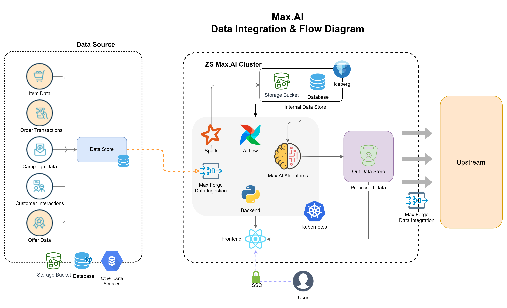

Architecture
============

Max.AI architecture is designed for efficient handling and processing of data, as well as modern LLM app development tasks. At its core the Max.AI components run on Kubernetes and containers making it cloud agnostic and are very scalable.

Components
^^^^^^^^^^

   
|
   
   
