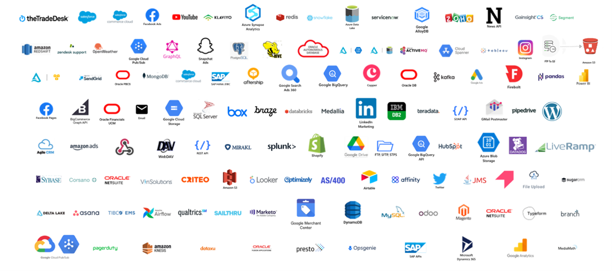
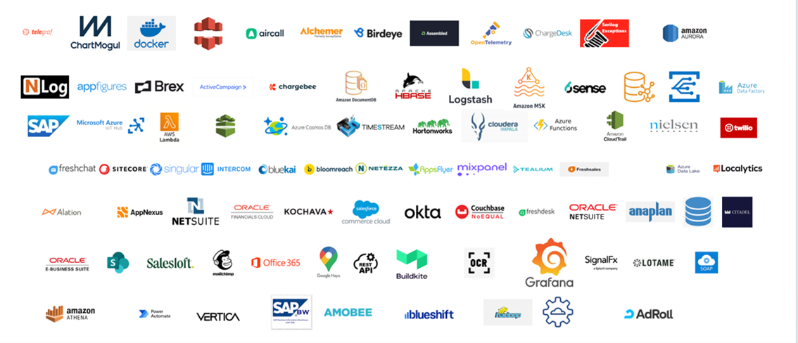

Data Connectors
===============

We have developed a robust ingestion layer to support data extraction from both structured and unstructured data sources. We rely on a combination of best-of-breed open-source data extraction tools and our own custom extraction library to ensure the ability to pull info from virtually any file format or data source. This provides Max.AI the ability to integrate with 250+ data source. 

