Workflow
========

Max.AI platform supports Automated devops powered by GitOps which helps developers to deploy their code at ease/simple clicks. Typical Build + deploment flow is shown in the below picture, where the developer writes/develops code on the notebooks (a service that is enabled via max) and commit their code to git of their choice (GitHub, azure repos or GitLab etc.).

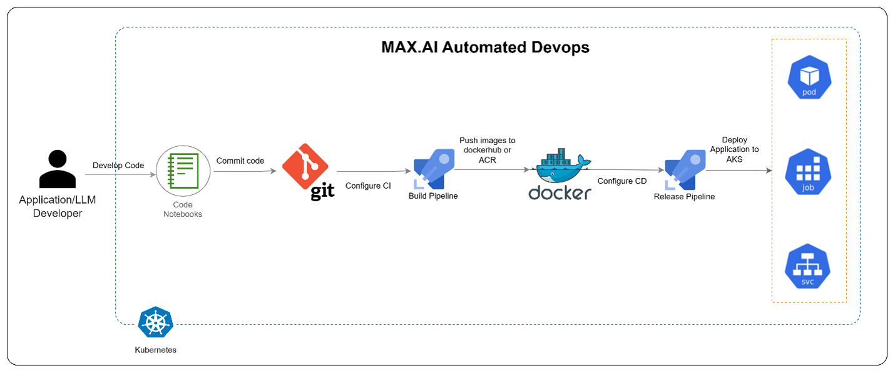
   
|

Let see how all the above steps can be configured on the max platform in detail:
    1.	**Configure GitOps**: Max.AI uses GitOps to pull Kubernetes configuration files of the applications. For storing the configuration files and desired state of the applications, Git credentials must be provided at Global Configurations > GitOps within the Application dashboard. The available git providers are:
    
        - GitHub
        - Bitbucket
        - Gitlab
        - Azure

|

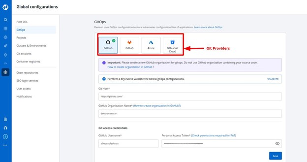

|
        
    2. **Configure Container registry**: User can configure a container registry either a public or private using any registry provider of choice. It allows the user to build, deploy, and manage your container images or charts with an easy-to-use UI.
    
|

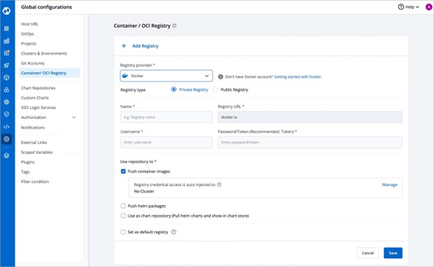
   
|

    3. **Create an application**: user can create an application on the platform with the code they have on git. This will include the workflow steps of CI/CD configuration as well.
    
        - Click on create new and choose custom app 

|
        
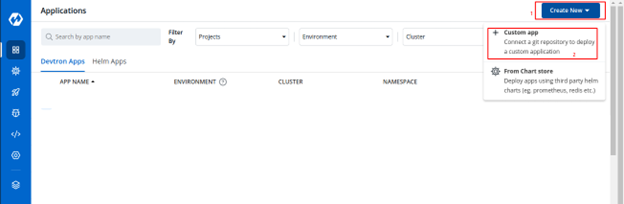
   
|

        - Provide the name and tags and click on create app.
        
|

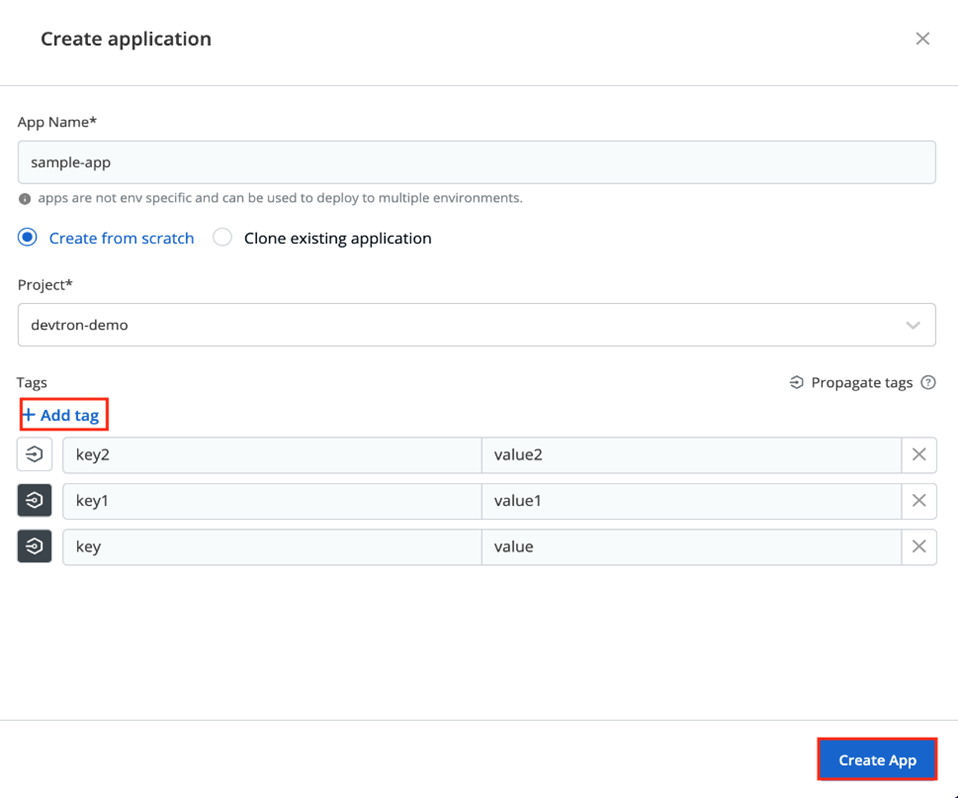
   
|

        - **Configure CI**: Build configuration is used to create and push docker images in the container registry of your application. You will provide all the docker related information to build and push docker images on the Build Configuration page.
        
|

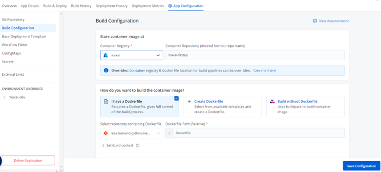
   
|
   
        - **Configure CD**: Configure the basic details like resource, port and env variables details of deployment in the deployment template section.
        
|

   
    4. **Build & Deploy**: Now it’s just stitching of previous steps we have done so far and get the full workflow completed.
        
|

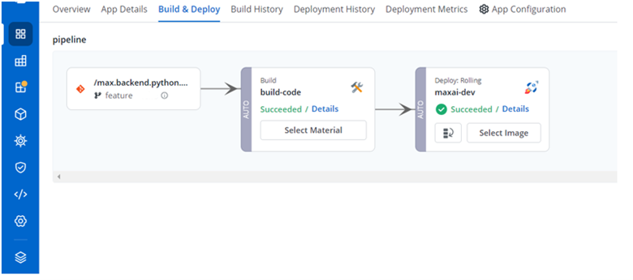

|

    5. **Chart Store Offering**: Max platform also provides users flexibility to deploy other helm charts provided in the offering. Ex: Airflow, Trino etc. Along with native Max.AI Core charts.
        
|

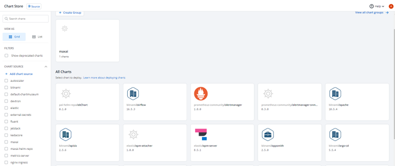

|

    6. **View Application details**: all the details of the application like workflow, Git Repo details and metrics of the application which is deployed.
    
|

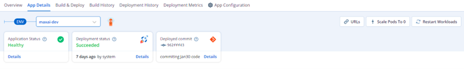
   
|

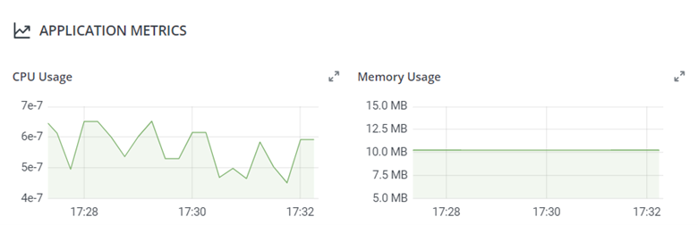
   
|

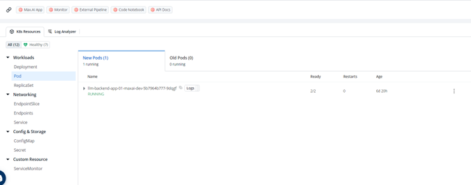

|

    7. **Notification Service**: With this feature, you can manage the notifications for your build and deployment pipelines. You can receive the notifications on Slack or via e-mail. Below are few configurations which max platform supports: 
        - SES Configurations 
        - SMTP Configurations 
        - Slack Configurations 

|

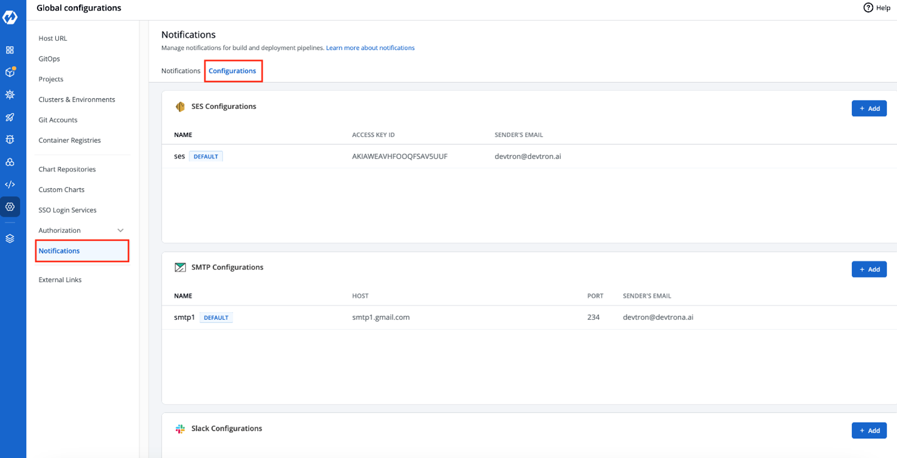

|

    8. **Security**: Max.AI CI pipeline provides a Scan for vulnerabilities powered by Trivy and Clair as an option shown below. Once you enable this option, it will automatically scan the image for vulnerabilities. 

|

.. image:: ../static/images/DevOps-8-Security.jpg
   :width: 600px
   :align: center
   :alt: DevOps-Pods

|

        - This action provides a detailed overview of the application's security scan, including CVE IDs, severity levels of vulnerabilities, and more, as shown below.

|

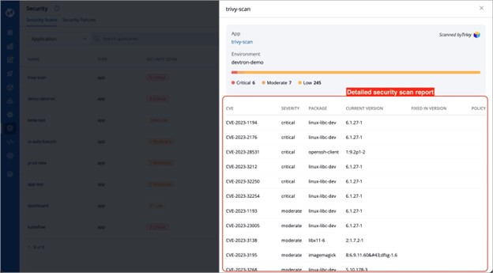

|

        - Each vulnerability is identified by a CVE ID and categorized based on *Severity*, *Package*, *Current Version*, and *Fixed In Version*.
        - **Accessing Vulnerability Information on the App Details Page**: Max.AI offers the capability to identify vulnerabilities even after an image has been deployed. By navigating to the App Details page, you can find comprehensive details about the vulnerabilities associated with the deployed image.

|

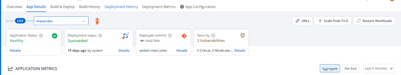

|

    9.	Authorization Services (SSO): Max.AI platform enables users to connect to different IDP providers and can easily connect to them with very minimal effort. User Groups and their permissions can be managed at ease. Below are the SSO providers which are available.
        - Google 
        - GitHub 
        - GitLab 
        - Microsoft 
        - LDAP 
        - OpenID 
        - Connect OpenShift
        
|

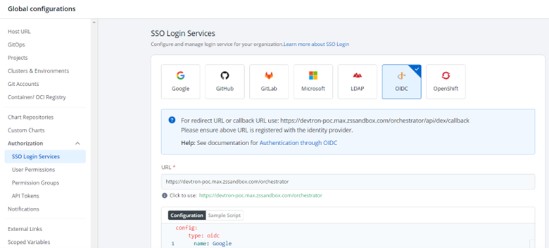

|
