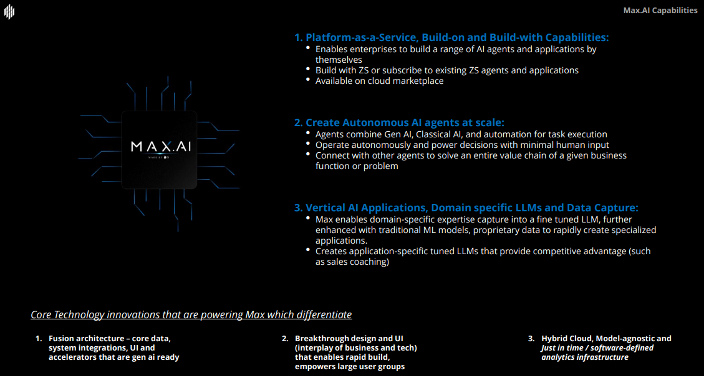

.. Max.AI documentation master file, created by
   sphinx-quickstart on Thu Dec  8 11:18:07 2022.
   You can adapt this file completely to your liking, but it should at least
   contain the root `toctree` directive.

Max.AI
======

|

⏩️ :doc:`Max.AI Data Integration </data_integration/architecture>`
    develop and provide accelerators for seamless integration
    
⏩️ :doc:`Max.AI DS Core </ds_core/about>`
    develop end-to-end Machine Learning pipelines
    
⏩️ :doc:`Max.AI LLM </llm/about>`
    fine-tune existing foundational models and deploying these refined models as part of a product

.. toctree::
   :maxdepth: 1
   :caption: 🌐 Max.AI

   About

|

.. toctree::
   :maxdepth: 2
   :caption: 🔗 Max.AI Data Integration

   data_integration/architecture
   data_integration/connectors
   
|

.. toctree::
   :maxdepth: 2
   :caption: 🧪 Max.AI DS Core
   
   ds_core/about
   ds_core/architecture
   ds_core/maxaidatahandling
   ds_core/maxaifeaturization
   ds_core/maxaimetadata
   ds_core/maxaimodel
   ds_core/maxaimonitoring
   ds_core/maxairesources
   ds_core/maxaimarketplace
   
|

.. toctree::
   :maxdepth: 2
   :caption: 🧠 Max.AI LLM
   
   llm/about
   llm/architecture
   llm/data
   llm/model
   llm/app
   llm/agents
   llm/documents
   llm/tuning
   
|

.. toctree::
   :maxdepth: 2
   :caption: ⚙️ Max.AI DevOps
