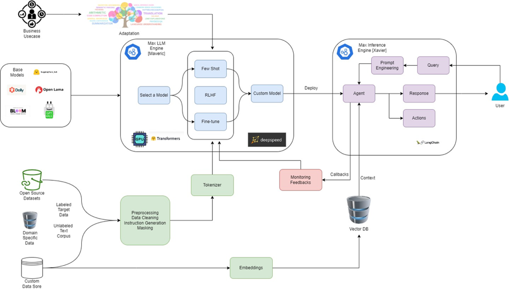

About
===========

Max LLM Development layer comes equipped with pre-built custom classes, designed with the user in mind. These classes are not mere utilities; they are gateways that mask the underlying complexities, providing a streamlined and intuitive interface for customization. Max LLM Development layer comes equipped with pre-built custom classes, designed with the user in mind. These classes are not mere utilities; they are gateways that mask the underlying complexities, providing a streamlined and intuitive interface for customization.

|

As illustrated in the above image, below is the detailed technical elaboration of Max LLM Development Layer:
    - Abstracted Training Process: The development layer abstracts the intricacies of model architectures, tokenization, and optimization techniques. Instead of writing numerous lines of code for setting up and training, users can initiate model training with just a few method calls.
    - Integrated Data Processing: Handling and preprocessing data for language models can be daunting. The development layer offers pre-built functions for data tokenization, batching, and shuffling, ensuring the data is in the right format for finetuning. The Data Processing Layer also supports numerous data connectors and eases out setting up the training, evaluation and validation dataset required for finetuning LLM.
    - Customizable Models: While the layer offers simplicity, it doesn’t restrict advanced users. Those who wish to customize the training loop, model architecture, or other components like optimizers or trainable parameters can easily do so. 
    - Pre-trained Models Integration: Instead of starting from scratch, the user can leverage various benchmarked LLM’s from the Max Model Hub which serves as a vast library for pre-trained models. The development modules provide easy loading of modules, with customizable parameters aiding transfer learning and reducing the time for training.

Try Max.AI LLM
^^^^^^^^^^^^^^
    - `Max.AI LLM Components <https://github.com/zs-personalize-ai/Max.AI-Playground/blob/master/llm/MaxLLMComponents.ipynb>`_
    - `Max.AI Agent Builder <https://github.com/zs-personalize-ai/Max.AI-Playground/blob/master/llm/MaxQAAgent.ipynb>`_